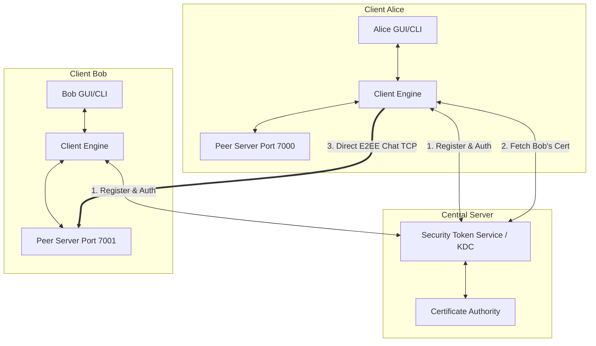

# Secure Chat Application: Comprehensive Project Analysis & Security Audit

This document provides a professional evaluation of the Secure Chat Application. It is divided into five phases covering architectural understanding, a security audit, software engineering review, recruitment evaluation, and an improvement roadmap.

---

## Phase 1 — Project Understanding

### 1. Problem Solved
The project implements a secure, hybrid end-to-end encrypted (E2EE) instant messaging application. It allows registered users to:
* Establish direct, peer-to-peer (P2P) secure chat sessions with other online users.
* Participate in group chat rooms.
* Securely share files with peers.
* Benefit from administrative control (user revocation and certificate blacklisting) via a central authority.

### 2. Overall Architecture
The application uses a **hybrid client-server and peer-to-peer (P2P)** architecture:
* **Security Token Service (STS) / Key Distribution Center (KDC)**: A centralized server that authenticates users, signs Certificate Signing Requests (CSRs), holds the database of online clients, maps usernames to their IP/port, and acts as a fallback relay for group messages or when direct connections cannot be established.
* **Clients**: Run either a Command Line Interface (`cli.py`) or a PyQt6 Graphical User Interface (`gui/app.py`). Each client runs an internal TCP server on a dedicated port to accept direct connections from other clients for direct, E2EE chats.
* **Shared Library (`common/`)**: Contains cryptographic operations (`crypto_utils.py`) and a custom message framing protocol (`transport.py`).



### 3. Protocols & Information Flow

#### Client-Server Communication
Communication occurs over raw TCP sockets using a custom JSON-based framing protocol. Every packet starts with a 4-byte big-endian unsigned integer header representing the payload length, followed by the UTF-8 encoded JSON payload.

#### Authentication Flow
Authentication is certificate-based, using a challenge-response protocol over TCP:
1. **`AUTH_INIT`**: Client connects to STS and requests an authentication challenge.
2. **`AUTH_CHALLENGE`**: STS generates a random 16-byte nonce, base64-encodes it, and sends it to the client.
3. **`AUTH_VERIFY`**: The client signs the raw nonce bytes with its private key (RSA-2048, PKCS#1 v1.5 padding) and sends its certificate (X.509 PEM) and the signature to the STS.
4. **STS Decision**:
   - STS verifies the client's certificate validity dates, verifies that it was signed by the root CA (`rootCA.pem`), and checks that the certificate serial number is not in the Certificate Revocation List (`revoked_serials.json`).
   - STS extracts the `Common Name (CN)` from the certificate (this is the username) and checks if the user is in `banned.json`.
   - STS verifies the signature on the challenge nonce using the public key from the certificate.
   - If successful, STS registers the connection, returns `AUTH_SUCCESS`, and broadcasts the updated online user list.

#### Session Establishment & Key Exchange (Direct Chat)
The application establishes E2EE direct sessions using a custom hybrid key exchange:
1. **`FETCH_CERT`**: Alice sends a request to the STS to fetch Bob's public certificate and connection info (IP/port).
2. **`PEER_CERT_RESPONSE`**: STS returns Bob's certificate and connection details.
3. **Key Generation**: Alice pins Bob's certificate (Trust-On-First-Use). She generates a random 32-byte symmetric `session_key` and a 16-byte `challenge_nonce`.
4. **Key Encapsulation**: Alice encrypts the `session_key` with Bob's public key (RSA-OAEP-SHA256). She signs the raw `session_key` with her private key (RSA-PKCS#1 v1.5).
5. **`RELAY_SESSION_KEY`**: Alice sends the encrypted session key, signature, base64-encoded challenge, her own certificate, and her peer port to the STS to relay to Bob.
6. **Relay**: STS forwards this package to Bob as `SESSION_INFO`.
7. **Session Import**: Bob decrypts the session key using his private key, verifies Alice's signature using her certificate's public key, pins Alice's certificate, and stores the session key.
8. **Direct Connection**: Bob initiates a raw TCP connection to Alice's IP and peer port.
9. **`SESSION_CONFIRM`**: Over the direct TCP connection, Bob computes an HMAC-SHA256 MAC of Alice's `challenge_nonce` using the shared `session_key` and sends it to Alice. Alice verifies the MAC. Both mark the session as `confirmed`.

#### Encryption / Decryption Process
* **Symmetric Encryption**: Messages and file chunks are encrypted using AES-GCM (256-bit key) with a cryptographically secure random 12-byte nonce.
* **Key Derivation Function (KDF) & Key Rotation**:
  - The application rotates the AES key every 10 messages using a KDF-based ratchet.
  - The sending/receiving counters are tracked. An `interval_index` is calculated as `(counter - 1) // 10`.
  - The active key for the interval is derived from the master `session_key` using HKDF-SHA256:
    $$\text{key}_{\text{interval}} = \text{HKDF}(\text{salt}=\text{None}, \text{info}=\text{bytes("chat\_interval\_" } + \text{index}), \text{secret}=\text{session\_key})$$

#### Storage of Messages & Keys
* **Messages**: Messages are not stored persistently by the application. Chat history is held in-memory in the GUI client's state (`MainWindow.chat_history`) and is lost when the client is closed.
* **Keys**:
  - The client's long-term RSA private key (`client.key`) and certificate (`client.crt`) are stored in plaintext under a folder named `client_<username>/` in the application directory.
  - Peer certificate hashes are saved in plaintext JSON under `client_<username>/known_peers.json` for TOFU pinning.
  - The central server's Root CA key (`rootCA.key`) and certificate (`rootCA.pem`) are stored in plaintext in the server directory.

### 4. Threat Model & Security Goals
The application aims to protect against the following threats:
* **Eavesdropping on Direct Chats**: Prevent passive network observers from reading direct messages or files by using AES-GCM E2EE.
* **Man-In-The-Middle (MITM) on Key Exchange**: Prevent active attackers from replacing public keys during exchange by using certificate pinning (TOFU) and central CA signing.
* **Replay Attacks**: Prevent attackers from capturing and re-sending old messages by checking timestamps (60s window) and enforcing monotonically increasing message counters.
* **Unauthorized Client Registration**: Prevent arbitrary client registrations by requiring a server administrator's master password.

### 5. Current System Limitations
1. **Direct Peer-to-Peer NAT Traversal**: Direct chat relies on direct TCP socket connection. If one or both clients are behind NATs or firewalls without port forwarding, the P2P connection will fail (no STUN/TURN/ICE implementation).
2. **In-Memory Message History Only**: Closing the app deletes all chat history.
3. **No Offline Messaging**: Messages sent to offline users are silently dropped.
4. **Single CA Bottleneck**: Central server holds the only CA key. If the server is offline, no new users can register.

---

## Phase 2 — Security Audit

This section lists vulnerabilities found in the codebase, categorized by severity.

### 1. Critical Vulnerabilities

#### [C-1] Complete Lack of Security in Group Chats (Hardcoded Symmetric Keys)
* **Location**: [client_engine.py](file:///c:/Users/groot/secure_chat_app/client_core/client_engine.py#L537-L542), [client_engine.py](file:///c:/Users/groot/secure_chat_app/client_core/client_engine.py#L676-L686)
* **Description**: Group chat sessions are initialized with a hardcoded static key: `b"static_group_key_32_bytes_shared"` or `b"32_byte_placeholder_group_key_!!!"`. 
* **Exploit Scenario**: Any attacker eavesdropping on the network or compromising the STS server can capture group chat packets and decrypt them instantly using the public hardcoded keys. Group chats offer zero confidentiality.
* **Remediation**: Implement a group key distribution protocol. The group creator should generate a random 32-byte group symmetric key and distribute it to each group member. The key should be encrypted individually using each member's public key (RSA-OAEP) and signed by the creator, relayed via STS.

#### [C-2] Bypassed Certificate Authority Validation (MITM Vulnerability)
* **Location**: [client_engine.py](file:///c:/Users/groot/secure_chat_app/client_core/client_engine.py#L284-L298), [client_engine.py](file:///c:/Users/groot/secure_chat_app/client_core/client_engine.py#L449-L466)
* **Description**: Although `crypto_utils.py` contains `verify_certificate()`, the client engine *never* calls it when receiving peer certificates. It only verifies the certificate hash against `known_peers.json` (TOFU pinning).
* **Exploit Scenario**: If Alice connects to Bob for the first time, Alice has no pinned certificate for Bob. A MITM attacker can intercept the `FETCH_CERT` or `RELAY_SESSION_KEY` packets, generate a self-signed certificate with Bob's CN, and present it to Alice. Because Alice never verifies if Bob's certificate was signed by the Root CA, she will accept it, pin it, and establish a session key with the attacker.
* **Remediation**: In `_handle_peer_cert_response` and `_handle_session_info`, call `verify_certificate(cert_pem, CA_CERT_PATH)` before performing the TOFU pin check.

#### [C-3] Plaintext Transmission of Master Password
* **Location**: [client_engine.py](file:///c:/Users/groot/secure_chat_app/client_core/client_engine.py#L715-L721)
* **Description**: The registration connection between the client and the STS is a raw TCP socket without TLS. The administrator's master password is sent in plaintext in the JSON payload (`"master_password": master_password`).
* **Exploit Scenario**: A network eavesdropper capturing traffic on port 6000 can sniff the administrator's master password in plaintext, giving them administrative control to register arbitrary malicious users or revoke certificates.
* **Remediation**: Wrap the client-server connection to STS in TLS, or use a secure password-authenticated key exchange (PAKE) or challenge-response scheme so the plaintext password is never sent over the wire.

#### [C-4] Plaintext Storage of Client Private Keys
* **Location**: [client_engine.py](file:///c:/Users/groot/secure_chat_app/client_core/client_engine.py#L738-L745)
* **Description**: The client's long-term RSA private key is saved on disk using `serialization.NoEncryption()`.
* **Exploit Scenario**: An attacker with local access to a user's machine (or malware running under the user's context) can copy `client.key` and immediately impersonate the user or decrypt any intercepted E2EE sessions.
* **Remediation**: Encrypt the private key on disk using a key derived from a user-supplied local passphrase (using PBKDF2 or Argon2id with AES).

---

### 2. High Vulnerabilities

#### [H-1] Lack of Perfect Forward Secrecy (PFS)
* **Location**: [client_engine.py](file:///c:/Users/groot/secure_chat_app/client_core/client_engine.py#L299-L318)
* **Description**: The session key exchange uses RSA key encapsulation: Alice encrypts a locally generated session key with Bob's long-term public key.
* **Exploit Scenario**: If an attacker records Alice and Bob's encrypted network traffic and later compromises Bob's long-term private key (`client.key`), they can decrypt the session keys and read all historical messages.
* **Remediation**: Implement Ephemeral Elliptic Curve Diffie-Hellman (ECDHE) key exchange (e.g. using `Curve SECP256R1` or `X25519`). Alice and Bob should exchange ephemeral EC public keys, sign them with their long-term RSA keys to prevent MITM, and derive the session key using ECDH.

#### [H-2] Unauthenticated Metadata in AES-GCM (Tampering Vulnerability)
* **Location**: [client_engine.py](file:///c:/Users/groot/secure_chat_app/client_core/client_engine.py#L182), [crypto_utils.py](file:///c:/Users/groot/secure_chat_app/common/crypto_utils.py#L20)
* **Description**: AES-GCM is used to encrypt messages, but the associated data (AD) parameter is set to `None`.
* **Exploit Scenario**: An attacker can modify packet metadata (such as the `session_id`, `sender` name, `counter`, or `timestamp`) in transit. Because this metadata is not part of the AES-GCM authentication tag, the ciphertext will decrypt successfully, allowing the attacker to spoof the sender's identity or bypass replay protections.
* **Remediation**: Pass a serialized representation of the metadata (e.g., `f"{session_id}:{sender}:{counter}:{timestamp}".encode()`) as the Associated Data to `aes_encrypt` and `aes_decrypt`.

#### [H-3] Weak Hashing of Master Password
* **Location**: [sts.py](file:///c:/Users/groot/secure_chat_app/sts/sts.py#L260-L268)
* **Description**: The server verifies the master password using a single round of SHA-256 (`hashlib.sha256(provided_master.encode()).hexdigest()`) and compares it to a hardcoded hash.
* **Exploit Scenario**: Since SHA-256 is an extremely fast hashing algorithm, if the server code is leaked, an attacker can perform high-speed offline brute-force or dictionary attacks (billions of hashes/sec on GPUs) to crack the master password.
* **Remediation**: Use a memory-hard password hashing algorithm like Argon2id or bcrypt, and store the configuration in a secure environment variable instead of hardcoding.

#### [H-4] Vulnerability to Replay Attacks in 60-Second Window
* **Location**: [client_engine.py](file:///c:/Users/groot/secure_chat_app/client_core/client_engine.py#L559-L561)
* **Description**: The replay protection checks if `abs(current_time - packet_time) > 60` and if `counter <= last_counter`. However, if Alice sends a message with `counter=5` and it is intercepted, and no newer message has been received yet, the attacker can replay this exact packet multiple times within the 60-second window. The client will decrypt and display it multiple times.
* **Remediation**: Keep a history of recently received message unique identifiers (e.g., a hash of the signature/nonce) within the time window to enforce strict deduplication.

---

### 3. Medium Vulnerabilities

#### [M-1] Use of Legacy PKCS#1 v1.5 Signature Padding
* **Location**: [crypto_utils.py](file:///c:/Users/groot/secure_chat_app/common/crypto_utils.py#L65), [crypto_utils.py](file:///c:/Users/groot/secure_chat_app/common/crypto_utils.py#L91)
* **Description**: RSA signatures are generated and verified using PKCS#1 v1.5 padding.
* **Exploit Scenario**: PKCS#1 v1.5 is old and susceptible to padding oracle attacks (e.g., Bleichenbacher's attack) under certain conditions.
* **Remediation**: Switch to RSA-PSS (Probabilistic Signature Scheme) padding, which is mathematically proven secure and standard in modern systems.

#### [M-2] Plaintext Databases on Central Server
* **Location**: [sts.py](file:///c:/Users/groot/secure_chat_app/sts/sts.py#L28-L31)
* **Description**: The databases of users, certificates, banned lists, and revoked serials are stored in plaintext JSON files on the server.
* **Exploit Scenario**: If an attacker gains filesystem access to the server, they can modify these databases to unban users, fake certificates, or read user registration lists.
* **Remediation**: Secure these databases with OS-level permission controls, encrypt them at rest, or migrate to a secure database management system (e.g., SQLite with encryption).

#### [M-3] Thread Safety Issues and Race Conditions in STS
* **Location**: [sts.py](file:///c:/Users/groot/secure_chat_app/sts/sts.py#L35), [sts.py](file:///c:/Users/groot/secure_chat_app/sts/sts.py#L193)
* **Description**: The `clients` dictionary is modified across threads inside `handle_client`. While some operations are wrapped in `with lock:`, others read `clients` outside of locks, creating potential race conditions.
* **Remediation**: Ensure all accesses (both reads and writes) to shared state dictionaries like `clients` and `groups` are strictly protected by the re-entrant lock.

---

### 4. Low Vulnerabilities

#### [L-1] In-Memory Key Exposure (Key Zeroization)
* **Location**: [client_engine.py](file:///c:/Users/groot/secure_chat_app/client_core/client_engine.py#L648-L657)
* **Description**: When a session is destroyed, the keys are deleted from dictionaries, but the underlying byte arrays are not zeroized in RAM. They remain in garbage-collected memory until overwritten.
* **Exploit Scenario**: An attacker performing a memory dump of the client process can extract active or past symmetric session keys.
* **Remediation**: Overwrite session keys with zeros (`bytearray(32)`) in memory before deleting references.

#### [L-2] Hardcoded Central Server Configurations
* **Location**: [cli.py](file:///c:/Users/groot/secure_chat_app/cli.py#L53-L55), [gui/app.py](file:///c:/Users/groot/secure_chat_app/gui/app.py#L31-L35)
* **Description**: The IP address (`127.0.0.1`) and port (`6000`) of the central STS server are hardcoded in the client apps.
* **Remediation**: Move network configurations to environment variables or a configuration file (`config.ini` / `.env`).

---

## Phase 3 — Software Engineering Review

An assessment of the codebase's software engineering quality.

### 1. Scores (Out of 10)

| Category | Score | Rationale |
| :--- | :---: | :--- |
| **Architecture** | **5 / 10** | Clear client-server/P2P model, but P2P requires open ports. The thread-per-client model on the server is primitive. |
| **Modularity** | **6 / 10** | Code is separated into modules, but some unused code exists, and client engine is too tightly coupled with the UI. |
| **Scalability** | **3 / 10** | Raw threads on the server do not scale. Direct P2P TCP connections fail behind symmetric NATs. |
| **Maintainability**| **4 / 10** | Hardcoded configs, no unit tests, and wide `except:` statements make the project fragile to modify. |
| **Readability** | **7 / 10** | Code logic is straightforward and generally well-commented. |
| **Error Handling** | **4 / 10** | Extensive use of broad `except Exception:` blocks, risking silent failures or unreleased resources. |
| **Logging** | **2 / 10** | No logging library is used. Raw `print` statements clutter stdout. |
| **Configuration** | **1 / 10** | Ports, hosts, database paths, and master password hashes are all hardcoded. |
| **Testing** | **0 / 10** | There are absolutely no automated tests. |
| **Documentation** | **1 / 10** | No `README.md`, `LICENSE`, or other standard setup documentation. |
| **Dependency Mgmt**| **4 / 10** | No `requirements.txt` or `pyproject.toml`. Dependencies are unmanaged. |

---

## Phase 4 — Recruiter & Resume Evaluation

This section evaluates the project's quality from a recruiter's perspective.

### 1. Scores (Out of 10)

* **Resume Value**: **4 / 10**
  - *Current*: A recruiter looking at this would see a standard socket program with major security flaws (hardcoded keys).
  - *Target*: Elevating it to an industry-standard E2EE system using Double Ratchet or ECDHE, complete with Docker, tests, and CI/CD would make it a standout portfolio piece.
* **GitHub Quality**: **2 / 10**
  - *Current*: Lacks standard repository files, structured branch layout, linters, and github action workflows.
* **Security Engineering Value**: **3 / 10**
  - *Current*: Shows familiarity with basic primitives, but implementation flaws (bypassed cert checks, hardcoded keys) suggest lack of depth.
* **Backend Engineering Value**: **4 / 10**
  - *Current*: Standard multi-threaded server. Lacks production-level asynchronous patterns (like `asyncio` or `selectors`), logging, and DB management.
* **Production Readiness**: **2 / 10**
  - *Current*: Cannot be deployed to staging/production easily. No containerization, lack of rate limits on TLS, no configuration files.
* **Technical Depth**: **4 / 10**
  - *Current*: Implementation covers sockets, threads, and basic pyOpenSSL/cryptography calls, but is shallow in security design.
* **Originality**: **5 / 10**
  - *Current*: E2EE chat apps are common, but the hybrid P2P connection model shows some design initiative.

### 2. Elevating to Master's Level
* **What makes it Beginner-Level**:
  * Hardcoded symmetric keys for group chats.
  * Disregarded CA verification on the client.
  * Storing user private keys in plaintext.
  * Lack of unit tests, Docker configurations, and proper package structure.
  * Thread-per-connection sockets instead of non-blocking I/O or `asyncio`.
* **What would make it Master's Level**:
  * Implementing **ECDHE key exchange** for Forward Secrecy.
  * Implementing a decentralized/relay-based **group key agreement** (like pairwise distribution or Signal-like sender keys).
  * Enforcing robust certificate verification.
  * Providing secure key storage (passphrase-derived encryption).
  * Rewriting server or client transport using asynchronous frameworks (`asyncio`).
  * Creating a complete suite of unit and integration tests.
  * Containerizing with Docker and adding GitHub Actions for CI/CD.

---

## Phase 5 — Improvement Roadmap

A prioritized list of items to refactor and implement.

### 1. Critical Priority (Fixes for security and correctness)
1. **Fix Certificate Verification**: Call `verify_certificate` before pinning peer keys.
   * *Effort*: Low.
   * *Resume Impact*: High. Shows cryptographic rigor.
   * *Files*: `client_engine.py`
2. **Implement Perfect Forward Secrecy (ECDHE)**: Replace RSA encryption exchange with ECDHE key exchange.
   * *Effort*: Medium.
   * *Resume Impact*: Critical. Essential for modern security engineers.
   * *Files*: `client_engine.py`, `crypto_utils.py`
3. **Secure Group Chats**: Replace hardcoded keys with a pairwise session key distribution protocol.
   * *Effort*: Medium.
   * *Resume Impact*: Critical. Demonstrates protocol design capability.
   * *Files*: `client_engine.py`
4. **AEAD AD Integrity Protection**: Include message headers in GCM Associated Data.
   * *Effort*: Low.
   * *Resume Impact*: High. Shows attention to detail.
   * *Files*: `client_engine.py`, `crypto_utils.py`
5. **Encrypt Private Keys**: Encrypt client private keys on disk using a passphrase-derived key.
   * *Effort*: Low.
   * *Resume Impact*: High.
   * *Files*: `client_engine.py`

### 2. High Impact (Software Engineering & Code Quality)
1. **Directory Restructuring**: Organize code into `client/`, `server/`, `shared/`, `docs/`, `tests/` directories.
   * *Effort*: Low.
   * *Resume Impact*: Medium. Shows clean project management.
   * *Files*: All files.
2. **Automated Testing Suite**: Create unit and integration tests under `tests/`.
   * *Effort*: Medium.
   * *Resume Impact*: High. Demonstrates professional engineering discipline.
   * *Files*: [NEW] `tests/`
3. **Environment & Configuration Management**: Introduce environment variable loading (`python-dotenv`) and config files.
   * *Effort*: Low.
   * *Resume Impact*: Medium.
   * *Files*: `client_engine.py`, `sts.py`
4. **Structured Logging**: Replace stdout `print` with python `logging`.
   * *Effort*: Low.
   * *Resume Impact*: Medium.
   * *Files*: All files.

### 3. Optional / Enhancements
1. **Docker Containerization**: Containerize the STS server.
   * *Effort*: Low.
   * *Resume/GitHub Impact*: Medium. Easy deployment.
   * *Files*: [NEW] `Dockerfile`, `docker-compose.yml`
2. **GitHub Actions**: Add workflows for formatting, linting, and tests.
   * *Effort*: Low.
   * *GitHub Impact*: High. Shows repository health.
   * *Files*: [NEW] `.github/workflows/`

---

## Directory Restructuring Plan (Phase X)

### Current Directory Tree:
```
secure_chat_app/
├── cert_db.json
├── cli.py
├── client_alice/
├── client_bob/
├── client_charlie/
├── client_core/
│   └── client_engine.py
├── common/
│   ├── crypto_utils.py
│   └── transport.py
├── gui/
│   ├── app.py
│   ├── main_window.py
│   └── register_window.py
├── revoked_serials.json
├── rootCA.key
├── rootCA.pem
├── rootCA.srl
├── sts/
│   └── sts.py
└── users.json
```

* **Strengths**: Small footprint, modular naming.
* **Weaknesses**: Root directory is cluttered with dynamic data (JSONs, CA keys, client folders) and mixes GUI and CLI in different places.

### New Directory Tree:
```
secure_chat_app/
├── client/
│   ├── __init__.py
│   ├── cli.py
│   ├── client_engine.py
│   ├── gui/
│   │   ├── __init__.py
│   │   ├── app.py
│   │   ├── main_window.py
│   │   └── register_window.py
│   └── data/                 # Auto-created user certificates and keys
├── server/
│   ├── __init__.py
│   ├── sts.py
│   └── data/                 # Server database and CA keys (isolated from root)
├── shared/
│   ├── __init__.py
│   ├── crypto_utils.py
│   └── transport.py
├── tests/
│   ├── __init__.py
│   ├── test_crypto.py
│   └── test_integration.py
├── docs/
│   ├── architecture.md
│   ├── protocol.md
│   └── security.md
├── README.md
├── SECURITY.md
├── ARCHITECTURE.md
├── LICENSE
├── CHANGELOG.md
├── CONTRIBUTING.md
└── requirements.txt
```

* **Rationale**:
  1. **Separation of Concerns**: Isolation of server-side resources (`server/data/`) and client-side files (`client/data/`) from code.
  2. **Modularity**: Clearly defined packages (`client`, `server`, `shared`) to make imports clean.
  3. **Industry Standard**: Easy for contributors to find documentation (`docs/`), tests (`tests/`), and utilities.
