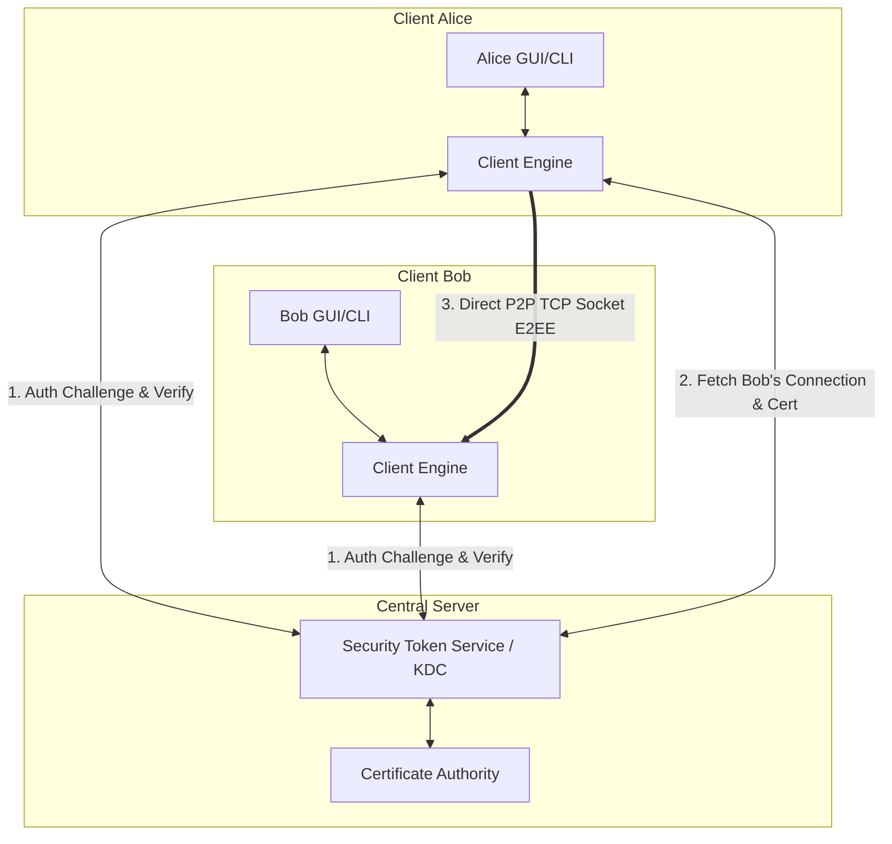

# Portfolio Project: Secure E2EE Hybrid P2P Chat Application

A secure, hybrid client-server and peer-to-peer (P2P) instant messaging application written in Python. It features end-to-end encryption (E2EE) using ephemeral ECDHE key exchanges, certificate-based challenge-response authentication, custom TCP framing, structured logging, and automated testing suites.



---

## 🌟 Key Features
- **Perfect Forward Secrecy (ECDHE)**: Chat keys are negotiated dynamically for each session using Ephemeral Elliptic Curve Diffie-Hellman (SECP256R1).
- **Certificate-Based Authentication**: Secure registration and challenge-response login verified using signed X.509 certificates and RSA-PSS signatures.
- **Secure Group Chats**: Creators distribute group session keys using pairwise key encapsulation encrypted via members' public RSA certificates.
- **Tamper-Resistant Metadata**: Enforces packet envelope integrity by passing header metadata (`session_id`, `sender`, `counter`, `timestamp`) as GCM Associated Data.
- **Encrypted Local Storage**: The client's long-term private key is saved on disk using password-derived PKCS#8 encryption.
- **Structured Logging & Diagnostics**: Logs are filtered by levels and written to server and client directories for post-mortem auditing.
- **CI/CD Integration**: Verified automatically with Github Actions pipelines.

---

## 🛠️ Technology Stack
- **Language**: Python 3.10+
- **Cryptography**: `cryptography` library (AES-GCM-256, RSA-2048, ECDHE-SECP256R1, HKDF, RSA-PSS)
- **GUI Framework**: PyQt6
- **Server Architecture**: Multi-threaded Socket Programming with re-entrant locks
- **Configuration**: Dotenv configuration management

---

## 📁 Repository Structure
For details on system architecture and design decisions, read [docs/ARCHITECTURE.md](docs/ARCHITECTURE.md).
- `client/`: CLI client, PyQt6 GUI, and Client Core engine.
- `server/`: KDC server (STS) logic and user registration databases.
- `shared/`: Shared cryptographic tools, transport framing, and logger wrappers.
- `tests/`: Automated unit and integration tests.
- `docs/`: Technical documents, roadmaps, and ADR records.

---

## 🚀 Quick Start (Production Setup)

### 1. Prerequisites
Install dependencies:
```bash
pip install -r requirements.txt
pip install -r requirements-dev.txt
```

### 2. Configure Environment
Copy the example environment configuration:
```bash
cp .env.example .env
```
*(Configure the parameters inside `.env` if necessary)*

### 3. Start the KDC Server
You can run the STS server directly using Python:
```bash
python -m server.sts
```
Or run it containerized using Docker:
```bash
docker compose up --build
```

### 4. Start Clients
Open separate terminals to run CLI clients:
```bash
# Register/Start client for Alice (Port 7000)
python -m client.cli Alice 7000

# Register/Start client for Bob (Port 7001)
python -m client.cli Bob 7001
```

Or run the GUI application:
```bash
python -m client.gui.app
```

---

## 🧪 Automated Testing
Run unit and socket-level integration tests locally:
```bash
python -m pytest tests/
```

---

## 🛡️ Security Audit & Roadmap
To view the detailed vulnerability report and audit results, read:
* [PROJECT_ANALYSIS.md](PROJECT_ANALYSIS.md)
* [Active Task Board (TODO.md)](TODO.md)
* [Project Changelog (CHANGELOG.md)](CHANGELOG.md)
